[crowdstax.com](https://www.crowdstax.com) &nbsp;·&nbsp;
[x](https://x.com/crowdstax) &nbsp;·&nbsp;
[threads](https://www.threads.net/@crowdstax) &nbsp;·&nbsp;
[github](https://github.com/tmckee09)

> Founder and full-stack product builder. 
> Building useful internet products, launch infrastructure, and durable discovery systems.

I build products end to end: strategy, interface, application logic, data models, 
payments, deployment, analytics, and the feedback loops that keep a product improving. 
Right now that is [Crowdstax](https://www.crowdstax.com) - a place for founders and builders 
to launch products, collect feedback, earn reviews, and keep building in public.

<samp>typescript &nbsp; next.js &nbsp; react &nbsp; node.js &nbsp; postgres &nbsp; supabase &nbsp; vercel &nbsp; stripe &nbsp; seo &nbsp; analytics &nbsp; git</samp>

**[Crowdstax](https://www.crowdstax.com)** &nbsp;·&nbsp; <samp>next.js, supabase, typescript</samp> 
A builder-focused product launch and discovery platform for feedback, reviews, 
community conversations, product updates, and long-term momentum after launch day.

**[Launch infrastructure](https://github.com/tmckee09)** &nbsp;·&nbsp; <samp>product systems, payments, automation</samp> 
Practical systems for turning a launch into a reliable product workflow — from 
submission and moderation to visibility, analytics, and ongoing iteration.

**[Growth systems](https://github.com/tmckee09)** &nbsp;·&nbsp; <samp>technical seo, content, analytics</samp> 
Search, content, and measurement systems designed to help useful products become 
discoverable without treating launch day as the finish line.

Every graphic here is generated and committed to this repository — no third-party profile widgets. 
`ascii.svg` is a local headshot transformed into a character portrait by 
[`scripts/make_portrait.py`](scripts/make_portrait.py). The contribution graphics and headings are 
drawn from GitHub's API by [a scheduled workflow](.github/workflows/stats.yml), once each day. 

The SVGs use inline fonts and SMIL animation because GitHub removes page scripts and custom CSS. 
That keeps the page self-contained, available, and consistent in GitHub light and dark mode.
